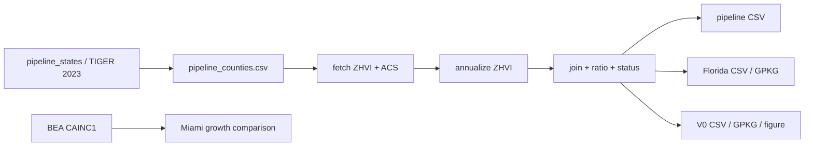
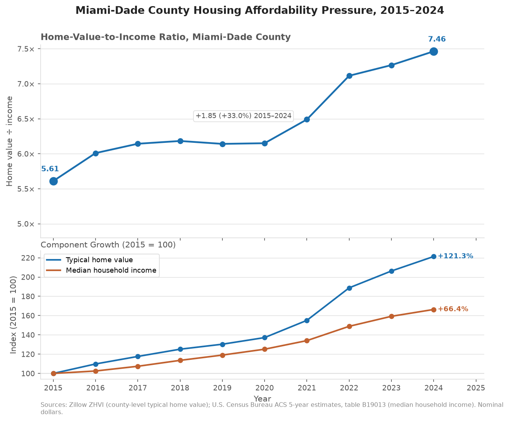

# Coastal Affordability Pressure Tracker

A county-year ETL and GIS pipeline that joins Zillow typical home values to ACS median household income, validates the resulting panel, and produces analytical and geospatial outputs. The current primary product covers **47 states**, **3,099 county equivalents**, and **30,990 county-year rows** for **2015–2024**, with explicit missing-data status rather than silent drops or fills.

Miami-Dade County is the original V0 case study and remains the regression anchor as geography expands.

<!-- TODO: insert committed 47-state / national choropleth or map figure here when available -->

---

## What the pipeline does

1. Builds a FIPS-based county reference from Census cartographic boundaries and a state manifest.
2. Acquires county ZHVI (Zillow) and ACS B19013 median household income.
3. Annualizes monthly ZHVI (mean of available months; no imputation).
4. Joins on `county_fips` + `year` and computes:

```text
home_value_to_income_ratio = typical_home_value / median_household_income
```

5. Assigns each county-year an explicit data-availability status.
6. Exports validated CSVs; Florida and Miami-Dade also export GeoPackages.
7. (Secondary, Miami-Dade only) Compares home-value growth to BEA total personal income.

The ratio is a **descriptive affordability-pressure metric**. A value of 5.0 means a typical home costs five times median household income. It is **not** a mortgage affordability model: it does not include interest rates, taxes, insurance, loan terms, down payments, debt, rents, or within-county distributions.

---

## Coverage at a glance

| Layer                  | Geography                           |   Rows | Primary outputs                                               |
| ---------------------- | ----------------------------------- | -----: | ------------------------------------------------------------- |
| **Pipeline (current)** | 47 states, 3,099 county equivalents | 30,990 | `data/processed/coastal_affordability_pipeline_2015_2024.csv` |
| Florida                | 67 counties                         |    670 | Florida CSV + GeoPackage                                      |
| Selected pilot         | Miami-Dade, Broward, Palm Beach     |    30* | Intermediate ACS/ZHVI CSVs                                    |
| V0 case study          | Miami-Dade (`12086`)                |     10 | CSV + GPKG + trend figure                                     |

*Selected-county intermediates are 3 counties × 10 years each (ACS and ZHVI); there is no separate selected-county affordability join table.

**Years:** 2015–2024 for all layers above.

**Included states:** AL, AR, AZ, CA, CO, DE, FL, GA, IA, ID, IL, IN, KS, KY, LA, MA, MD, ME, MI, MN, MO, MS, MT, NC, ND, NE, NH, NJ, NM, NV, NY, OH, OK, OR, PA, RI, SC, SD, TN, TX, UT, VA, VT, WA, WI, WV, WY.

**Outside the pipeline:** Connecticut is excluded because TIGER 2023 planning regions, Zillow’s former-county geography, and ACS panels are not longitudinally compatible under the existing FIPS join. Alaska, Hawaii, and DC are not currently included in the pipeline.

---

## Technical decisions and interesting problems

| Decision                                  | Why it matters                                                                                                                                                         |
| ----------------------------------------- | ---------------------------------------------------------------------------------------------------------------------------------------------------------------------- |
| **Join on FIPS/GEOID, never county name** | Avoids ambiguous and unstable name matching across sources.                                                                                                            |
| **Incremental geographic expansion**      | V0 → selected FL counties → statewide FL → 47-state panel, with expected counts locked in scripts.                                                                     |
| **Subset regression checks**              | Later stages re-assert that Miami-Dade and Florida analytical subsets still match committed earlier outputs.                                                           |
| **Explicit status taxonomy**              | Incomplete source coverage is retained and labeled instead of dropped.                                                                                                 |
| **No silent imputation**                  | Missing ZHVI months or ACS values are never filled, interpolated, or substituted.                                                                                      |
| **County equivalents**                    | Independent cities and other Census county equivalents (e.g. VA cities, Baltimore city, St. Louis city, Carson City) are included when present in the TIGER reference. |
| **Connecticut held out**                  | Documented source-geography collision; excluded until a separate method is defined.                                                                                    |

Field definitions, status rules, and per-file schemas: [`docs/data_dictionary.md`](docs/data_dictionary.md).

---

## Pipeline architecture



| Stage                                               | Script                                                                                         |
| --------------------------------------------------- | ---------------------------------------------------------------------------------------------- |
| County reference                                    | `src/build_pipeline_county_reference.py`                                                       |
| Fetch ZHVI                                          | `src/fetch_zillow_zhvi.py`                                                                     |
| Annualize ZHVI (V0 / selected / FL / pipeline)      | `src/transform_zillow_zhvi.py`                                                                 |
| Fetch ACS (legacy Miami / FL / pipeline)            | `src/fetch_acs_income.py`                                                                      |
| V0 join                                             | `src/build_affordability_table.py`                                                             |
| Florida join                                        | `src/build_florida_affordability_table.py`                                                     |
| 47-state join                                       | `src/build_pipeline_affordability_table.py`                                                    |
| Miami GeoPackage                                    | `src/build_county_geospatial.py`                                                               |
| Florida GeoPackage                                  | `src/build_florida_geospatial.py`                                                              |
| Miami trend figure                                  | `src/create_affordability_figure.py`                                                           |
| BEA fetch / transform / growth compare (Miami only) | `src/fetch_bea_income.py`, `src/transform_bea_income.py`, `src/build_bea_growth_comparison.py` |

---

## Data sources

| Source                               | Series                                    | Role                                        | Join key     |
| ------------------------------------ | ----------------------------------------- | ------------------------------------------- | ------------ |
| Zillow ZHVI (county)                 | Typical home value, monthly → annual mean | Primary home-value input                    | County FIPS  |
| Census ACS 5-year, table B19013      | Median household income                   | Primary income input                        | County FIPS  |
| Census cartographic boundaries, 2023 | County / county-equivalent polygons       | Reference + GIS geometry                    | GEOID / FIPS |
| BEA CAINC1 Line 1                    | Total personal income                     | Secondary Miami-Dade growth comparison only | County FIPS  |

API keys (project-root `.env`, gitignored): `CENSUS_API_KEY` for ACS; `BEA_API_KEY` only for the Miami BEA path.

---

## Validation and missing-data handling

Scripts enforce expected geography counts, year coverage, duplicate-free county-year keys, FIPS formatting, and (where applicable) GeoPackage round-trips and Florida/Miami regression checks.

**Pipeline affordability status** (`affordability_data_status`):

| Status                    |   Rows | Meaning                                                                |
| ------------------------- | -----: | ---------------------------------------------------------------------- |
| `available_complete`      | 28,908 | 12 ZHVI months + ACS present; ratio calculated                         |
| `available_partial`       |    560 | Partial ZHVI month coverage + ACS present; ratio from available months |
| `source_data_unavailable` |  1,522 | ZHVI and/or ACS missing; ratio null                                    |

Incomplete county-years stay in the panel. Florida documents one approved ZHVI gap: Monroe County (`12087`) 2015 has null home value and ratio (`source_data_unavailable`); 2016 is partial (11 months).

V0 Miami-Dade still requires 10 complete rows with no null analytical fields.

---

## Reproduction

From the repository root:

```bash
python3 -m venv .venv
.venv/bin/python -m pip install -r requirements.txt

# Optional for live ACS / BEA fetches (keys in .env):
# CENSUS_API_KEY=...
# BEA_API_KEY=...

# County reference (47-state)
.venv/bin/python src/build_pipeline_county_reference.py

# Acquire and transform
.venv/bin/python src/fetch_zillow_zhvi.py
.venv/bin/python src/transform_zillow_zhvi.py
.venv/bin/python src/fetch_acs_income.py

# Analytical tables
.venv/bin/python src/build_affordability_table.py
.venv/bin/python src/build_florida_affordability_table.py
.venv/bin/python src/build_pipeline_affordability_table.py

# GIS + Miami figure
.venv/bin/python src/build_county_geospatial.py
.venv/bin/python src/build_florida_geospatial.py
.venv/bin/python src/create_affordability_figure.py

# Optional Miami-only BEA comparison
.venv/bin/python src/fetch_bea_income.py
.venv/bin/python src/transform_bea_income.py
.venv/bin/python src/build_bea_growth_comparison.py
```

Committed processed outputs can be inspected without re-fetching. Live ACS/BEA steps require valid API keys.

---

## Key outputs

| File                                                            | Description                                                              |
| --------------------------------------------------------------- | ------------------------------------------------------------------------ |
| `data/processed/coastal_affordability_pipeline_2015_2024.csv`   | 47-state panel, 30,990 county-year rows                                  |
| `data/processed/coastal_affordability_florida_2015_2024.csv`    | Florida statewide panel, 670 rows                                        |
| `data/processed/florida_affordability_2015_2024.gpkg`           | Florida GeoPackage, layer `florida_affordability_county_year`, EPSG:4269 |
| `data/processed/coastal_affordability_county_v0.csv`            | Miami-Dade V0 analytical table, 10 rows                                  |
| `data/processed/miami_dade_affordability_2015_2024.gpkg`        | Miami-Dade GeoPackage, layer `miami_dade_affordability`, EPSG:4269       |
| `reports/figures/miami_dade_affordability_trend.png`            | Miami-Dade trend figure                                                  |
| `data/processed/miami_dade_bea_growth_comparison_2015_2024.csv` | Miami-only BEA growth comparison                                         |
| `data/manual/pipeline_counties.csv`                             | Authoritative 3,099-row county reference                                 |
| `docs/data_dictionary.md`                                       | Schemas, status rules, exclusions                                        |

---

## Miami-Dade case study / findings

Original V0 geography (`12086`), still used for regression. Figures below are from `data/processed/coastal_affordability_county_v0.csv` (nominal dollars).



| Measure                    | 2015     | 2024     | Change              |
| -------------------------- | -------- | -------- | ------------------- |
| Typical home value         | $242,822 | $537,394 | +$294,572 (+121.3%) |
| Median household income    | $43,129  | $71,753  | +$28,624 (+66.4%)   |
| Home-value-to-income ratio | 5.6301   | 7.4895   | +1.8594 (+33.0%)    |

Typical home values rose faster than median household income over the period, so the ratio increased. This is descriptive only; the dataset does not identify causes.

A separate Miami-Dade BEA personal-income growth comparison is available in `data/processed/miami_dade_bea_growth_comparison_2015_2024.csv`. It is not part of the 47-state primary pipeline.

---

## Limitations

* County-level aggregates conceal sub-county variation.
* ZHVI is a modeled typical value, not a census of transaction prices or total housing-market capitalization.
* ACS 5-year estimates are overlapping multi-year windows and carry sampling error (MOEs not stored in this pipeline).
* Values are nominal; no inflation adjustment.
* The ratio excludes financing costs, taxes, insurance, rents, and income or price distributions within counties.
* 2023 boundary geometry is used consistently across 2015–2024 (not year-specific historical boundaries).
* EPSG:4269 is suitable for storage/display, not for area or distance without reprojection.
* Incomplete county-years remain in the panel with null ratios where sources are missing.
* Connecticut is excluded because of source-geography incompatibilities; Alaska, Hawaii, and DC are not currently included.
* BEA comparison is Miami-Dade only.

---

## Current status / next steps

**Done:** Reproducible 47-state ACS/ZHVI affordability panel with statused missing data; Florida and Miami-Dade GIS exports; Miami trend figure; Miami BEA comparison path; FIPS reference manifests; regression-checked expansion scripts.

**Docs note:** [`docs/data_dictionary.md`](docs/data_dictionary.md) describes the current multi-state system. [`docs/methodology_v0.md`](docs/methodology_v0.md) and [`reports/qa_v0.md`](reports/qa_v0.md) are V0-era and do not fully describe the 47-state pipeline.

**Plausible next work:** commit a 47-state map artifact; extend geospatial export beyond Florida; refresh V0-era QA/methodology docs; decide and document AK/HI/DC policy; optionally expand BEA beyond Miami-Dade.
